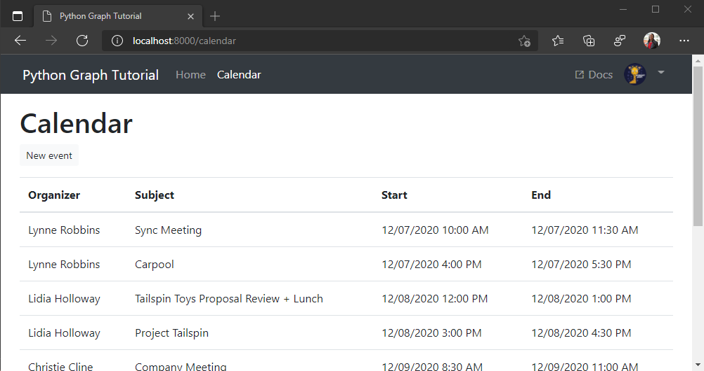

<!-- markdownlint-disable MD002 MD041 -->

Neste exercício, você incorporará o Microsoft Graph no aplicativo. Para este aplicativo, você usará a biblioteca de [solicitações-OAuthlib](https://requests-oauthlib.readthedocs.io/en/latest/) para fazer chamadas para o Microsoft Graph.

## <a name="get-calendar-events-from-outlook"></a>Obter eventos de calendário do Outlook

1. Comece adicionando um método a **./tutorial/graph_helper. py** para buscar os eventos do calendário. Adicione o seguinte método.

    :::code language="python" source="../demo/graph_tutorial/tutorial/graph_helper.py" id="GetCalendarSnippet":::

    Considere o que esse código está fazendo.

    - A URL que será chamada é `/v1.0/me/events`.
    - O `$select` parâmetro limita os campos retornados para cada evento para apenas aqueles que o modo de exibição realmente usará.
    - O `$orderby` parâmetro classifica os resultados pela data e hora em que foram criados, com o item mais recente em primeiro lugar.

1. Em **./tutorial/views.py**, altere a `from tutorial.graph_helper import get_user` linha para o seguinte.

    ```python
    from tutorial.graph_helper import get_user, get_calendar_events
    ```

1. Adicione o seguinte modo de exibição a **./tutorial/views.py**.

    ```python
    def calendar(request):
      context = initialize_context(request)

      token = get_token(request)

      events = get_calendar_events(token)

      context['errors'] = [
        { 'message': 'Events', 'debug': format(events)}
      ]

      return render(request, 'tutorial/home.html', context)
    ```

1. Abra **./tutorial/URLs.py** e substitua as instruções `path` existentes por `calendar` :

    ```python
    path('calendar', views.calendar, name='calendar'),
    ```

1. Entre e clique no link **calendário** na barra de navegação. Se tudo funcionar, você deverá ver um despejo JSON de eventos no calendário do usuário.

## <a name="display-the-results"></a>Exibir os resultados

Agora você pode adicionar um modelo para exibir os resultados de forma mais amigável.

1. Crie um novo arquivo no diretório **./tutorial/templates/tutorial** chamado `calendar.html` e adicione o código a seguir.

    :::code language="html" source="../demo/graph_tutorial/tutorial/templates/tutorial/calendar.html" id="CalendarSnippet":::

    Isso executará um loop através de uma coleção de eventos e adicionará uma linha de tabela para cada um.

1. Adicione a seguinte `import` instrução à parte superior do arquivo **./Tutorials/views.py** .

    ```python
    import dateutil.parser
    ```

1. Substitua o `calendar` modo de exibição no **./tutorial/views.py** pelo código a seguir.

    :::code language="python" source="../demo/graph_tutorial/tutorial/views.py" id="CalendarViewSnippet":::

1. Atualize a página e o aplicativo agora deve renderizar uma tabela de eventos.

    
