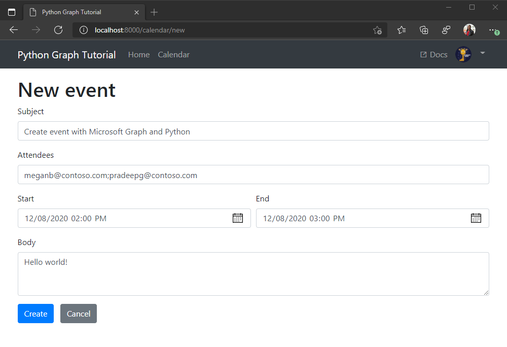

<!-- markdownlint-disable MD002 MD041 -->

Nesta seção, você adicionará a capacidade de criar eventos no calendário do usuário.

1. Adicione o seguinte método a **./tutorial/graph_helper. py** para criar um novo evento.

    :::code language="python" source="../demo/graph_tutorial/tutorial/graph_helper.py" id="CreateEventSnippet":::

## <a name="create-a-new-event-form"></a>Criar um novo formulário de eventos

1. Crie um novo arquivo no diretório **./tutorial/templates/tutorial** chamado `newevent.html` e adicione o código a seguir.

    :::code language="html" source="../demo/graph_tutorial/tutorial/templates/tutorial/newevent.html" id="NewEventSnippet":::

1. Adicione o seguinte modo de exibição a **./tutorial/views.py**.

    :::code language="python" source="../demo/graph_tutorial/tutorial/views.py" id="NewEventViewSnippet":::

1. Abra **./tutorial/URLs.py** e adicione uma `path` instrução para o `newevent` modo de exibição.

    ```python
    path('calendar/new', views.newevent, name='newevent'),
    ```

1. Salve suas alterações e atualize o aplicativo. Na página **calendário** , selecione o botão **novo evento** . Preencha o formulário e selecione **criar** para criar o evento.

    
